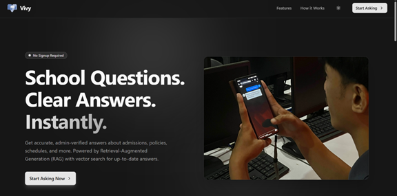
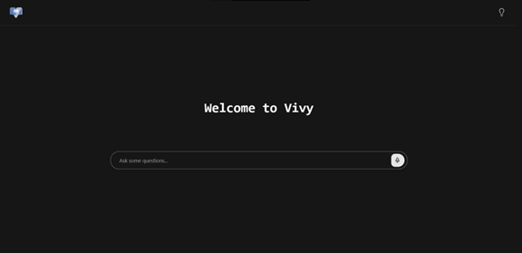
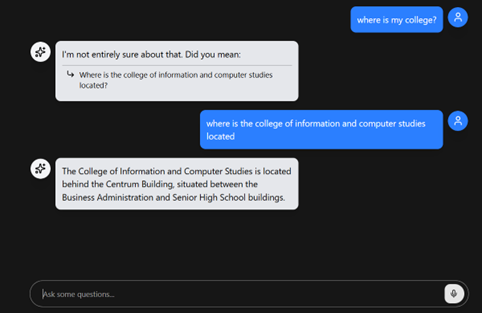
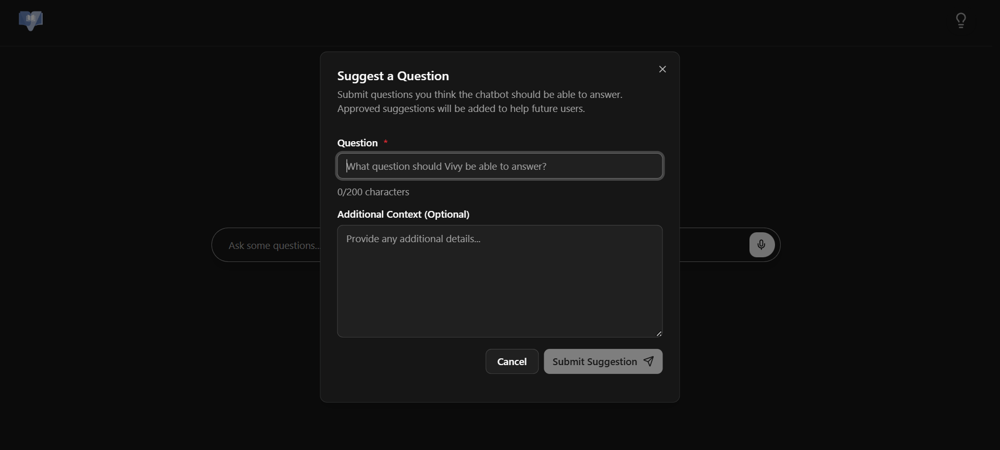
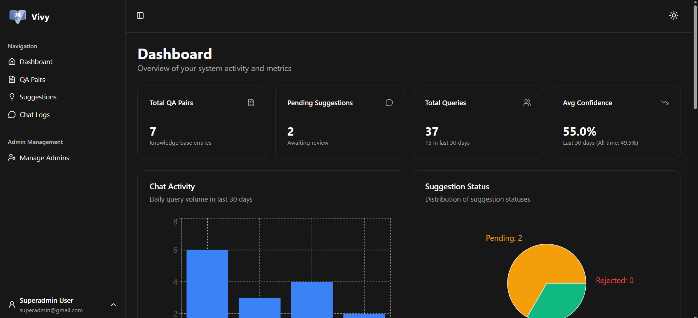
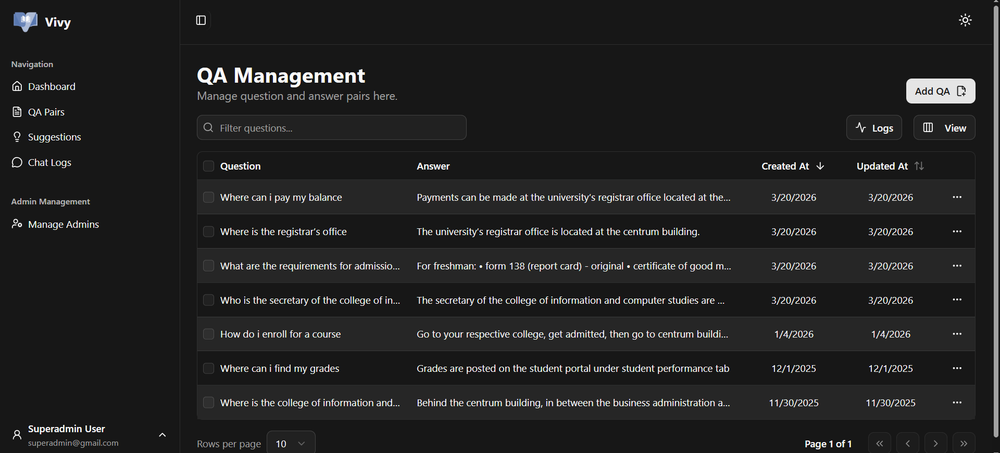
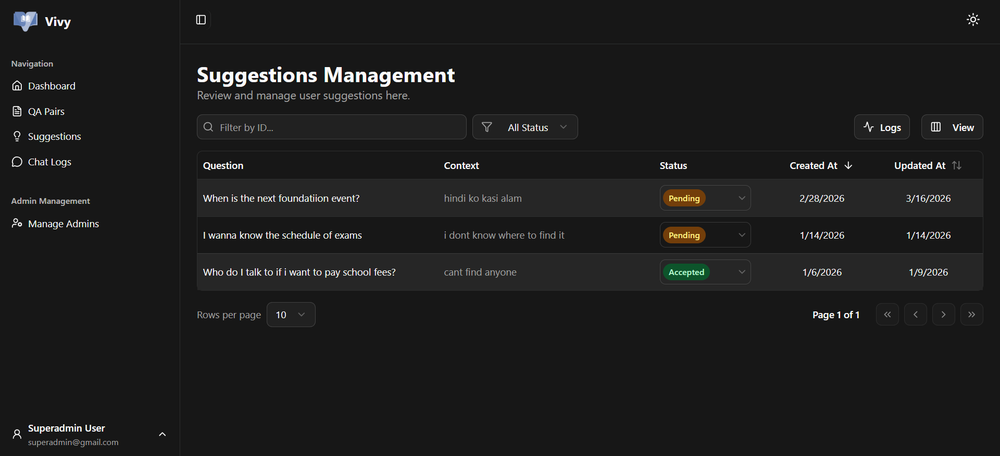
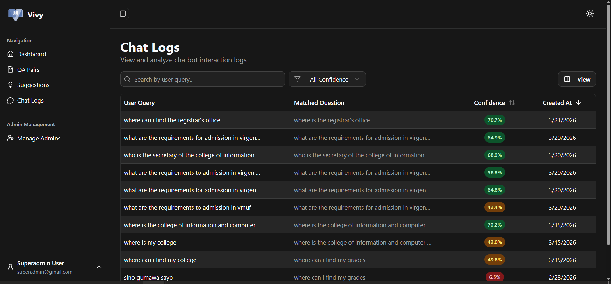
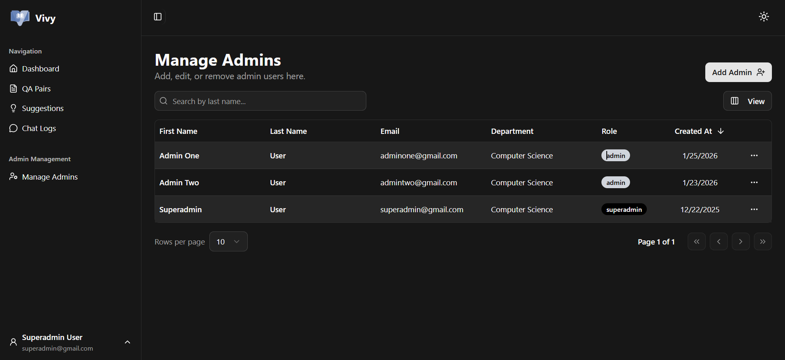

# 🤖 VMUF Query Chatbot

### _RAG-Based AI Query System for Virgen Milagrosa University Foundation Inc._

 

> A dynamic query system that uses Retrieval Augmented Generation (RAG)  
> to provide fast and accurate answers to institutional inquiries  
> for Virgen Milagrosa University Foundation Inc.

**Try the system here:**  
https://vivy-chatbot.vercel.app/

---

## 🖼 Screenshots

### Public Pages

<table>
<tr>
<td align="center">

Landing Page  

</td>
<td align="center">

Chat Interface  

</td>
</tr>

<tr>
<td align="center">

Chatbot Conversation  

</td>
<td align="center">

Question Suggestion  

</td>
</tr>
</table>

---

### Admin Panel

> Note  
> All data shown inside the admin panel screenshots are mock data for privacy reasons,  
> except for the QA Management tab where entries are intended to be public knowledge base data.

<table>
<tr>
<td align="center">

Dashboard  

</td>
<td align="center">

QA Management  

</td>
</tr>

<tr>
<td align="center">

Suggestions Management  

</td>
<td align="center">

Chat Logs  

</td>
</tr>

<tr>
<td align="center">

Manage Admins (Superadmin)

</td>
<td></td>
</tr>
</table>

---

## 📌 Overview

This project is a web-based AI chatbot designed to automate responses to common school-related questions such as schedules, admissions, programs, policies, and services.

The system uses a Retrieval Augmented Generation (RAG) pipeline with vector embeddings to retrieve relevant information from a knowledge base and generate context-aware responses.

The goal of the project is to:

- Reduce repetitive inquiries to faculty
- Provide instant and consistent answers
- Centralize institutional information
- Modernize university communication

---

## ⚙️ Features

- 🤖 AI chatbot with RAG pipeline
- 🔎 Vector similarity search using Pinecone
- 🧠 Cohere embedding and generation API
- 📚 Admin-managed knowledge base
- 💬 Question suggestion system
- 📝 Admin action logs
- 🔐 Role-based admin access
- ⚡ Real-time chat interface
- ☁ Free-tier cloud deployment

---

## 🧱 Tech Stack

Frontend

- React
- Vite
- Tailwind CSS
- shadcn/ui

Backend

- Node.js
- Express.js

Database

- Supabase (PostgreSQL)

Vector Database

- Pinecone

AI Models

- Cohere Embedding API
- Cohere Generate API

Deployment

- Vercel (Frontend)
- Render (Backend)
- Supabase (Database)
- Pinecone (Vector DB)
- UptimeRobot (keep free tier active)

---

## 🧠 System Architecture

User → React Frontend → Express Backend → RAG Pipeline

RAG Pipeline

1. Convert query to embedding
2. Search vector database
3. Retrieve context
4. Generate response
5. Return answer

---

## 👥 User Roles

Student

- Ask questions
- View responses
- Suggest queries

Administrator

- Add QA pairs
- Edit knowledge base
- Delete entries
- Review suggestions
- View logs
- Manage admins

---

## ⚠ Limitations

- Uses free-tier APIs
- Limited token usage
- Backend may sleep on free hosting
- Knowledge base must be maintained manually
- Not connected to official school portal

---

## 🎓 Thesis Information

Title  
Dynamic Query System Using a RAG-Based Chatbot and Vector Databases for Virgen Milagrosa University Foundation Inc.

Institution  
Virgen Milagrosa University Foundation Inc.  
San Carlos City, Pangasinan, Philippines

College  
College of Information and Computer and Information Studies

Duration  
August 2025 – April 2026

---

## 📄 License

This project is for academic purposes.
